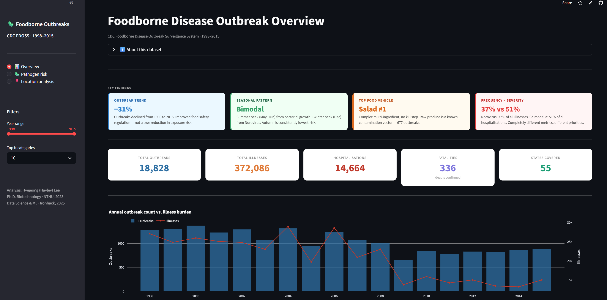

# 🍽️ Foodborne Disease Outbreak Analysis

### *CDC FDOSS 1998–2015 · EDA · SQL Analysis · Entity Normalisation · Interactive Dashboard*

[](https://python.org)
[](https://cdcfoodborneoutbreakseda.streamlit.app/)
[](https://pandas.pydata.org)
[](https://plotly.com)
[](https://sqlite.org)

---

## 🖥️ Streamlit Application

[](https://cdcfoodborneoutbreakseda.streamlit.app/)

**Live dashboard →** [cdcfoodborneoutbreakseda.streamlit.app](https://cdcfoodborneoutbreakseda.streamlit.app/)

A 3-page interactive dashboard: outbreak trends and seasonality, pathogen burden and severity rankings, and setting-level risk profiling — with a global year-range filter and top-N selector.

---

## 📌 Overview

An end-to-end data analysis project on **18,828 confirmed foodborne disease outbreak records** from the US Centers for Disease Control and Prevention (CDC), spanning 18 years (1998–2015) across 55 states and territories.

The project moves from raw surveillance data to a production-grade interactive dashboard, with domain-informed analytical decisions at every stage — reflecting the author's background in food safety microbiology and quantitative biology.

**Data source →** [CDC FDOSS via Kaggle](https://www.kaggle.com/datasets/cdc/foodborne-diseases)



---

## 🔑 Key Findings

| Dimension | Finding |
|---|---|
| **Trend** | Outbreak frequency declined 31% from 1998 to 2015 |
| **Seasonality** | Bimodal: summer bacterial peak (May–Jun) + winter Norovirus peak (Dec) |
| **Illness burden** | Norovirus: **39.5%** of all illnesses (137,642 cases) |
| **Hospitalisation burden** | *Salmonella enterica*: **54%** of all hospitalisations |
| **Highest fatality rate** | *Listeria monocytogenes*: **16%** (large N, clinically established) |
| **Highest-risk food–pathogen pair** | Norovirus × Salad: 10,835 illnesses |
| **Setting scale anomaly** | Prison/Jail avg **107 cases/event** — 8× Restaurant average |
| **Setting severity anomaly** | Private Home hosp. rate **9.3%** — 3× Restaurant (3.6%) |
| **Fatality concentration** | Nursing Home: **44 deaths** from 186 outbreaks (0.78% fatality rate) |

**Central analytical observation:** Frequency rankings and severity rankings invert across both pathogens (Norovirus vs Salmonella) and settings (Restaurant vs Prison/Home). The mechanisms behind these patterns are observable in the data; their causes require information beyond what FDOSS records.

---

## 🗂️ Project Structure

```
foodborne-disease-eda/
├── data/
│   ├── outbreaks.csv                    # Raw CDC dataset (19,119 records)
│   └── cleaned_data_grouped.csv         # Final analysis-ready dataset (18,828 × 12)
│
├── NB1_Data_Cleaning.ipynb              # Audit, deduplication, missing value strategy
├── NB2_Entity_Normalisation.ipynb       # RapidFuzz grouping + manual mapping + location
├── NB3_EDA.ipynb                        # Full EDA: univariate, bivariate, location analysis
├── NB4_SQL_Analysis.ipynb               # SQL analysis: aggregation, JOIN, window functions, CASE WHEN
│
├── dashboard.py                         # 3-page Streamlit dashboard
└── requirements.txt
```

---

## 🏗️ Analysis Pipeline

### 🧹 01 · Data Cleaning

**Input:** `outbreaks.csv` — 19,119 raw records × 12 columns  
**Output:** `cleaned_data.csv` — 18,828 records × 9 columns

| Problem | Decision | Rationale |
|---|---|---|
| 291 duplicate rows | Removed | True duplicates confirmed |
| Location missing (2,151) | `→ 'Unknown'` | Preserves outbreak count integrity |
| Food missing (8,697) | `→ 'Unknown'` | 47% retention; temporal analysis still valid |
| Species missing (6,390) | `→ 'Unknown'` | Same rationale; missingness is informative |
| Hospitalizations / Fatalities missing | `→ 0.0` | Conservative; absence of report ≠ absence of event |
| Ingredient / Serotype / Status | Dropped | 80–90% missing; outside EDA scope |

---

### 🔤 02 · Entity Normalisation

**Input:** `cleaned_data.csv`  
**Output:** `cleaned_data_grouped.csv` — + three new columns: `Food_grouped`, `Species_grouped`, `primary_location`

The raw dataset contains **3,128 unique Food strings** and **201 unique Species strings** due to 18 years of free-text entry across 55 jurisdictions. Naive groupby analysis on raw strings conflates "Chicken, Fried", "Chicken Salad", and "Chicken, Unspecified" as distinct categories.

**Method — four-stage pipeline:**

```
Stage 1: RapidFuzz token_sort_ratio (threshold 70 for Food, 85 for Species)
         → auto-clusters near-duplicate strings by edit distance

Stage 2: Domain-informed manual mapping (60 Food corrections, 11 Species corrections)
         → resolves cases where string similarity alone is insufficient
         e.g. "Norovirus genogroup I/II" → Norovirus (same epidemiological unit)
              "Chicken Salad" → Chicken (analytical decision under uncertainty;
               the true contamination source cannot be determined without lab data)

Stage 3: Repeated-entry collapse
         → "Salmonella enterica; × 13" → "Salmonella enterica"
         → genuine co-infections ("Bacillus cereus; Norovirus") preserved unchanged

Stage 4: Location primary venue extraction
         → "Restaurant; Catering Service; Grocery Store" → "Restaurant"
         → 161 compound strings → 21 meaningful venue types
```

**Results:**

| Column | Before | After | Reduction |
|---|---|---|---|
| Food | 3,128 strings | 1,366 categories | 56% |
| Species | 201 strings | 139 categories | 31% |
| Location | 161 compound strings | 21 venue types | 87% |

**Why RapidFuzz over TF-IDF or embeddings:** Empirical comparison on this dataset showed that all three methods achieve similar accuracy on Type 1 problems (spelling variants) but all fail on Type 2 problems (semantic classification — e.g., which primary vehicle drives a mixed dish). The irreducible constraint is domain knowledge, not algorithm choice. RapidFuzz was selected for transparency and interpretability of the matching process.

**Scope limitation:** The binding analytical constraint is not ungrouped categories but the 46.2% Unknown rate in Food — a structural property of CDC surveillance design that no normalisation method can resolve.

---

### 📊 03 · Exploratory Data Analysis

**Analysis structure:** Univariate → Bivariate (Num×Num, Cat×Num, Cat×Cat) → Location risk profiling

| Section | Focus | Key observation |
|---|---|---|
| **3.1 Temporal** | Annual trend + seasonality | Outbreaks declined 31% from 1998–2015; bimodal seasonal pattern |
| **3.2 Food & pathogen frequency** | Top food vehicles + pathogens by outbreak count | Salad #1 food vehicle; Norovirus dominates frequency but not severity |
| **3.3 Geography** | State + primary venue distribution | Florida #1 state; Restaurant accounts for 54% of outbreaks by count |
| **3.4 Setting severity profile** | Outbreak scale × hospitalisation rate × fatality | Three anomalous settings: Prison/Jail (107 cases/event), Private Home (9.3% hosp rate), Nursing Home (44 fatalities) |
| **4.1 Num × Num** | Illnesses vs hospitalisations correlation | Pearson r = 0.39 — outbreak size alone does not predict hospitalisation burden |
| **4.2 Pathogen burden & severity** | Total illnesses vs hospitalisations; hosp/fatality rates | Norovirus leads illness count; Salmonella leads hospitalisation burden — rankings invert by metric |
| **4.3 Temporal × pathogen** | Annual + seasonal pathogen composition | Pathogen composition stable across years; Norovirus peaks winter, Salmonella peaks summer |
| **4.4 Food × pathogen matrix** | Illness burden by food–pathogen combination | Norovirus × Salad: 10,835 illnesses — highest of any single combination |
| **3.5 Setting × pathogen** | Pathogen composition per venue type | Norovirus dominant in most settings; *C. perfringens* leads in Prison/Jail; *Salmonella* leads in Private Home |

---

### 🗄️ 04 · SQL Analysis

**Input:** `cleaned_data_grouped.csv` loaded into SQLite via Python  
**Notebook:** `NB4_SQL_Analysis.ipynb`

SQL re-analysis of the EDA findings — reproducing and extending NB3 results using structured queries. Demonstrates Python + SQL integration via `sqlite3` and `pandas.read_sql_query`.

| SQL technique | Applied in |
|---|---|
| `SELECT`, `GROUP BY`, `ORDER BY`, `LIMIT` | Q1–Q9: temporal, geographic, frequency analysis |
| Aggregate functions: `COUNT`, `SUM`, `ROUND` | Q1–Q9 |
| Derived metrics: `SUM(x) / SUM(y)` | Q10–Q11: hospitalisation and fatality rates |
| `WHERE`, `HAVING` | Q10–Q11: small-N artefact filtering |
| Multi-column `GROUP BY` | Q12: food × pathogen combinations |
| Subquery in `FROM` + `JOIN` | Q13: state severity score (outbreak count × hosp rate) |
| `CASE WHEN` classification | Q14: pathogen risk tier (Critical / Severe / Moderate / Low) |
| Window functions: `LAG`, `SUM OVER` | Q15: year-on-year change + cumulative outbreak count |

**Key SQL findings:**

| Query | Finding |
|---|---|
| Q13 · JOIN | State severity score reveals high-frequency states are not always high-severity |
| Q14 · CASE WHEN | *Listeria monocytogenes* and *Salmonella* classified Critical/Severe; Norovirus classified Low despite highest illness burden |
| Q15 · Window functions | YoY decline trend confirmed from 2000 peak; cumulative total reaches 18,828 by 2015 |

---

### 🖥️ Dashboard

A 3-page interactive Streamlit application with a global year-range filter and top-N selector.

| Page | Focus | Charts |
|---|---|---|
| **📊 Overview** | Trend, seasonality, geography, frequency | Annual dual-axis trend, monthly seasonality, state ranking, food/pathogen frequency |
| **🦠 Pathogen risk** | Burden, severity rates, seasonal composition, food×pathogen matrix | Illness vs hospitalisation bar charts, hosp/fatality rate rankings, seasonal stacked bar, interactive heatmap |
| **📍 Location analysis** | Setting severity profile, three-dimension severity comparison, setting×pathogen | Bubble chart, 3-panel severity bars, interactive heatmap |

---

## 🧰 Tech Stack

| Layer | Tools |
|---|---|
| Data wrangling | Python · pandas · numpy |
| String normalisation | RapidFuzz (fuzzy matching) |
| Statistical analysis | pandas · scipy |
| Database queries | SQLite · SQL (aggregation, JOIN, window functions, CASE WHEN) |
| Visualisation (EDA) | matplotlib · seaborn |
| Visualisation (dashboard) | Plotly Express · Plotly Graph Objects |
| Dashboard framework | Streamlit |

---

## ▶️ Setup and Run

```bash
git clone https://github.com/hyejeong0617/foodborne_outbreaks_eda.git
cd foodborne_outbreaks_eda
pip install -r requirements.txt
streamlit run dashboard.py
```

**Notebook execution order:**
```
NB1_Data_Cleaning.ipynb
    → cleaned_data.csv
NB2_Entity_Normalisation.ipynb
    → cleaned_data_grouped.csv
NB3_EDA.ipynb
    → (analysis and visualisations)
NB4_SQL_Analysis.ipynb
    → (SQL queries and visualisations)
```

---

## 🔬 Domain Context

This project applies the analytical discipline developed during doctoral research at NTNU (2019–2023), where I characterised antimicrobial resistance genes and virulence factors in *Aeromonas* spp. at the molecular level. The transition from genomic-scale data to population-level surveillance data requires the same core skill: generating falsifiable hypotheses from noisy biological data and being precise about what the data can and cannot establish.

Specific domain knowledge that shaped analytical decisions in this project:

- Recognising that the seasonal bimodality (summer peak vs winter peak) reflects pathogen ecology rather than reporting artefact — and treating it as a data observation, not a confirmed mechanism
- Correctly merging "Norovirus genogroup I" and "Norovirus genogroup II" as the same epidemiological entity while keeping *Salmonella enterica* and *Salmonella* spp. as separate categories for aggregation purposes
- Recognising that multi-ingredient dish classifications (e.g. "Chicken Salad") are analytical decisions under uncertainty, not microbiological determinations — and documenting this limitation explicitly
- Interpreting *Vibrio vulnificus* 50% fatality rate as a small-N artefact (2 cases) vs *Listeria monocytogenes* 16% as clinically established (large N)
- Distinguishing between what FDOSS data can establish (observed patterns in setting × pathogen distribution) and what it cannot (transmission mechanisms, causal explanations)

---

## 🔗 Related Projects

| Project | Domain | Type | Status |
|---|---|---|---|
| [rasff_risk_predictor](https://github.com/hyejeong0617/rasff_risk_predictor) | EU regulatory notifications | ML pipeline · NLP · Streamlit | ✅ Live |
| **This repo** | Food safety surveillance | EDA · SQL · entity normalisation · Streamlit | ✅ Live |
| [aeromonas-growth-predictor](https://github.com/hyejeong0617/aeromonas-growth-predictor) | Predictive microbiology · food safety | ML · GPR · SHAP · Streamlit | ✅ Live |
| [amr_genomics_aeromonas](https://github.com/hyejeong0617/amr_genomics_aeromonas) | Microbial genomics · One Health | WGS pipeline · Python analysis · Streamlit | ✅ Live |

**The four projects form a connected portfolio** — analysing food safety risk at four scales: real-time EU regulatory signal (RASFF ML), population-level surveillance (this repo), growth kinetics modelling (Aeromonas predictor), and molecular genomics (AMR genomics).

---

## 📬 Contact

**Hyejeong Lee** — PhD · Food Microbiology & Data Science

[](https://www.linkedin.com/in/hyejeong-lee-75887465/)
[](https://github.com/hyejeong0617)

*Open to Domain Data Scientist / Regulatory Data Analyst roles in food safety, 
      pharma, and biotech — Remote / Hybrid · Germany-based.*
